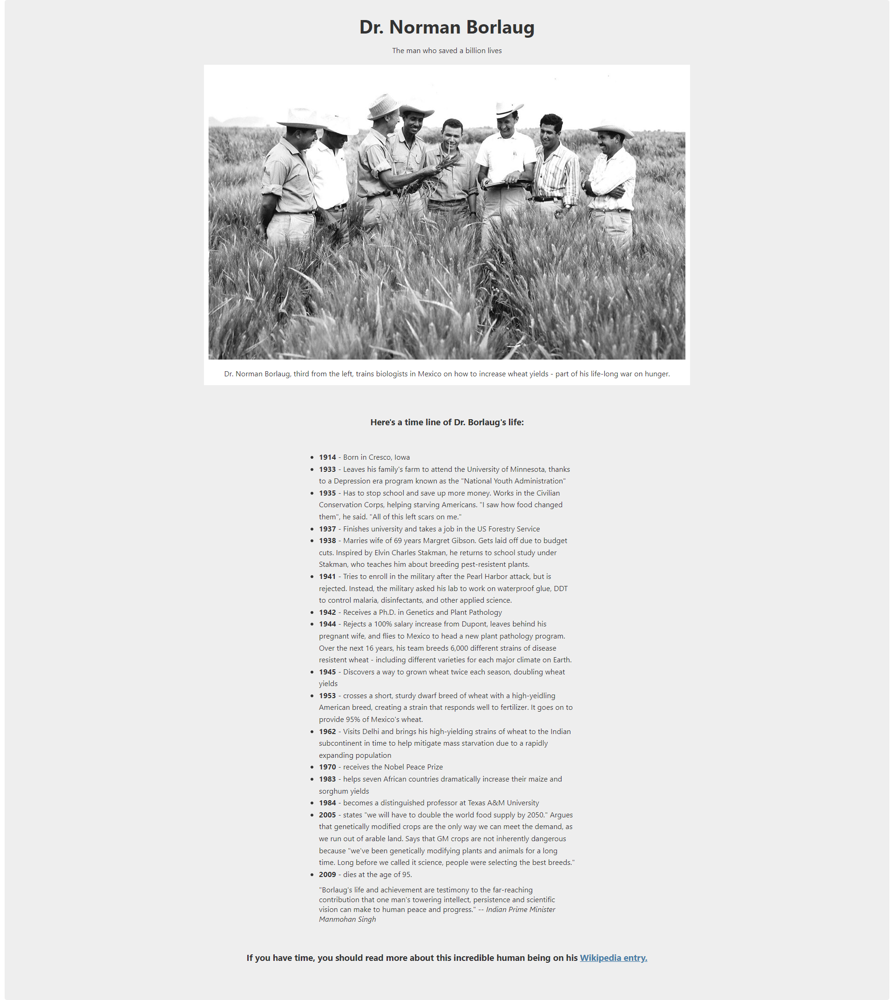
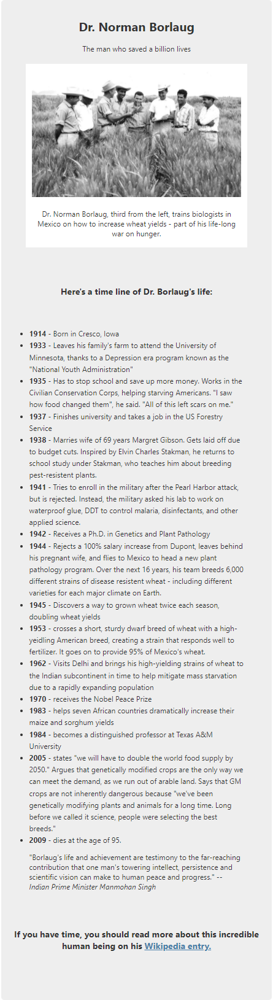

# Free Code Camp - Tribute Page

This is a solution to the [Free Code Camp - Tribute Page](https://www.freecodecamp.org/learn/responsive-web-design/responsive-web-design-projects/build-a-tribute-page).

## Table of contents

- [Overview](#overview)
  - [The challenge](#the-challenge)
  - [Screenshot](#screenshot)
- [My process](#my-process)
  - [Built with](#built-with)
  - [What I learned](#what-i-learned)
  - [Continued development](#continued-development)
  - [Useful resources](#useful-resources)
- [Author](#author)

## Overview

### The challenge

Complete all the use stories to pass.

It was recommended to use HTML, JavaScript, and CSS to complete this project. Plain CSS is recommended because that is what the lessons have covered so far and you should get some practice with plain CSS.

### Screenshot




## My process

### Built with

- Semantic HTML5 markup
- CSS custom properties
- Flexbox
- Mobile-first workflow

### What I learned

In this project I've learned to work with resizable widths using the piece of code below 👇🏿

```css
max-width: 100%;
width: auto;
```

Also in this project I've learned to place objects with different sizes on top of each other. That way the page felt like I was mounting a piece of paper on top of another piece of paper. You can see what I'm saying looking this piece of code below 👇🏿

```css
:root {
  background-color: white;
  width: 100%;
}

body {
  width: 99%;
  background-color: #eee;
}

#img-div {
  background-color: white;
  padding: 10px;
}
```

And finally working on **root level** feels more natural now. I think it works really great for small projects. I'm still get the haging of wortking with flexbox and placing the elements on the exact place of the design.

### Continued development

I've been studying **flexbox** and composing layouts for some time now. I'm finally getting the hang of it, but I still got a long way to go. So I'll keep studying and praticing on some projects to finally master it.

### Useful resources

- [A Complete Guide to Flexbox
  ](https://css-tricks.com/snippets/css/a-guide-to-flexbox/)
  - This helped me for the work better with flexbox and also understand how the parents and children elements work.

## Author

- Frontend Mentor - [@fcoxico](https://www.frontendmentor.io/profile/fcoxico)
- Linkedin - [@franciscojcardoso/](https://www.linkedin.com/in/franciscojcardoso)
